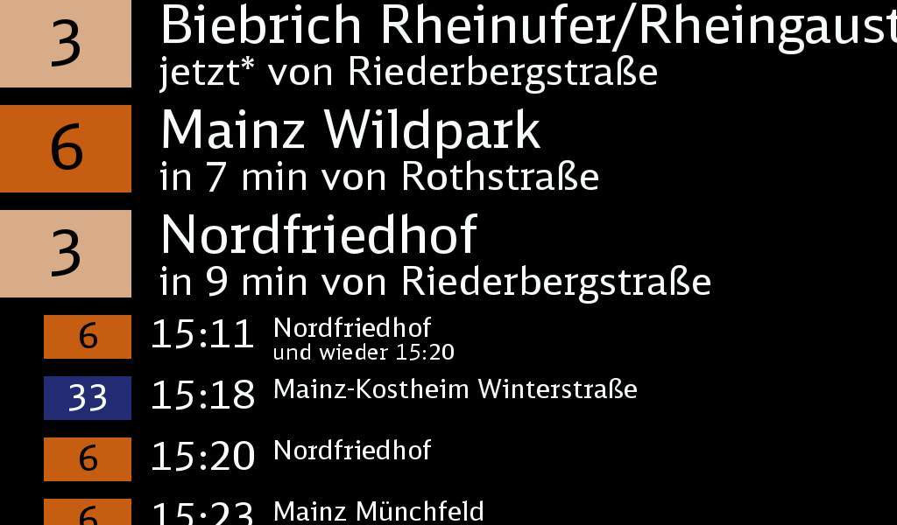
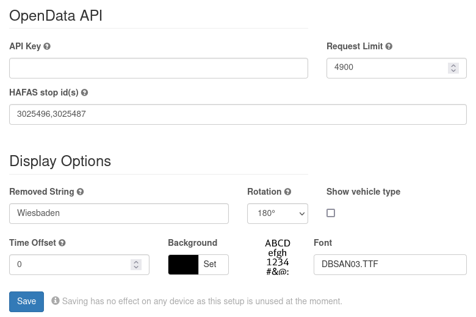

# RMV Abfahrtsplan

Note: since RMV is a transit district from Hesse, Germany, the package
description is only available in German.

Dieses Package für info-beamer hosted zeigt die nächsten Abfahrten einer
oder mehrerer Haltestellen im Bereich des
[Rhein-Main-Verkehrsverbunds (RMV)](https://www.rmv.de/) an.

Zur Konfiguration wird ein API-Key der [RMV-OpenData-API](https://opendata.rmv.de/)
und die HAFAS-Haltestellen-ID benötigt. Letztere kann z. B. aus der
[Haltestellenliste](https://opendata.rmv.de/site/files/rmv01/RMV_Haltestellen.zip),
erhältlich über das OpenData-Portal, entnommen werden.

Da die OpenData-API maximal 5000 Requests pro API-Key und Stunde zulässt,
kann im Package ein Limit konfiguriert werden. Basierend auf der Anzahl
der Haltestellen und dem eingestellten Limit wird automatisch eine
Refresh-Rate ermittelt, die das Limit nicht überschreitet.

In den *Display Options* können verschiedene Einstellungen getätigt werden,
die das Aussehen betreffen:

- Die Option *Removed String* enthält einen String, der aus den Haltestellen- und Zielnamen entfernt wird. Hierüber kann z. B.  der lokale Ortsname entfernt werden.
- Die Option *Rotation* gibt die Display-Rotation an.
- Mit der Option *Show vehicle type* wird vor der Liniennummer ein Symbol eingeblendet, das den verwendeten Fahrzeugtyp angibt. Derzeit gibt es folgende Symbole:
  - Eisenbahn (Fernverkehr)
  - Eisenbahn (Nahverkehr)
  - S-Bahn
  - Tram/Straßenbahn
  - U-Bahn
  - Bus
- Mit *Time Offset* kann bestimmt werden, ab wann Abfahrten ausgeblendet werden. Mit einem Wert von `5` werden alle Abfahrten ausgeblendet, die weniger als 5 Minuten entfernt werden.
- Die Hintergrundfarbe kann mit *Background* eingestellt werden. Bitte bei der Auswahl der Hintergrundfarbe darauf achten, dass die Schriftfarbe derzeit fix auf *weiss* eingestellt ist.
- Die verwendete Schriftart kann mit *Font* eingestellt werden.

Der oben gezeigte Screenshot entspricht bis auf die Display-Rotation den
gezeigten Einstellungen.
